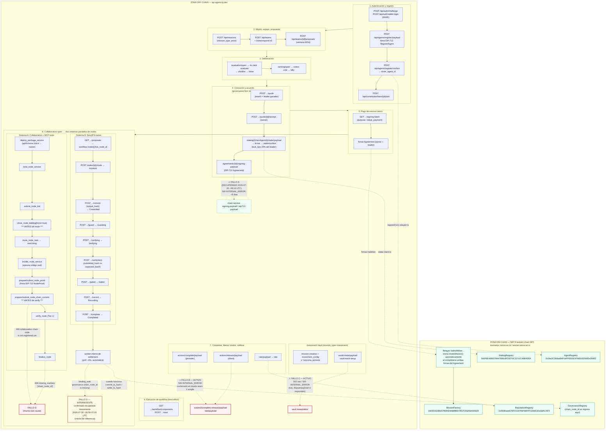
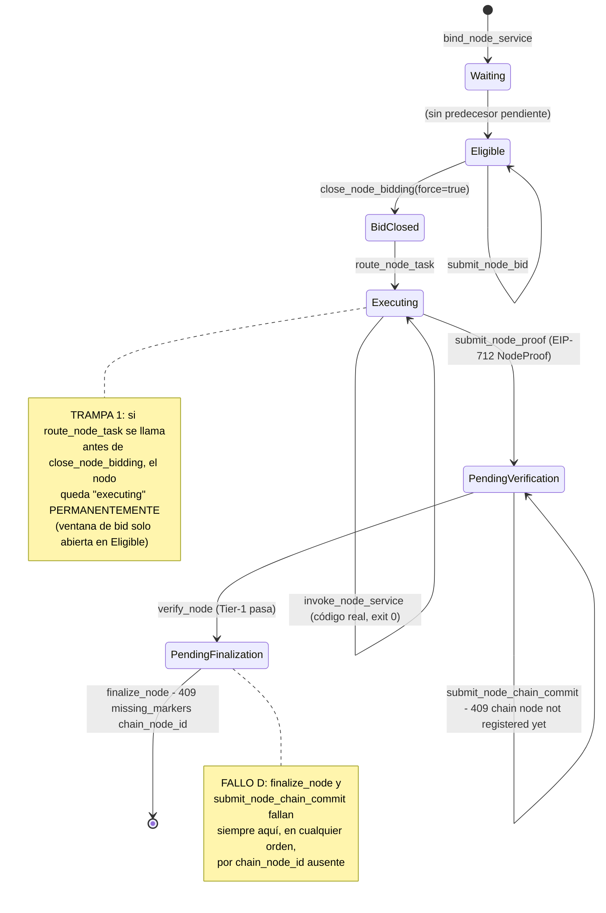
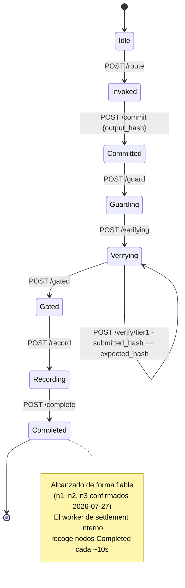
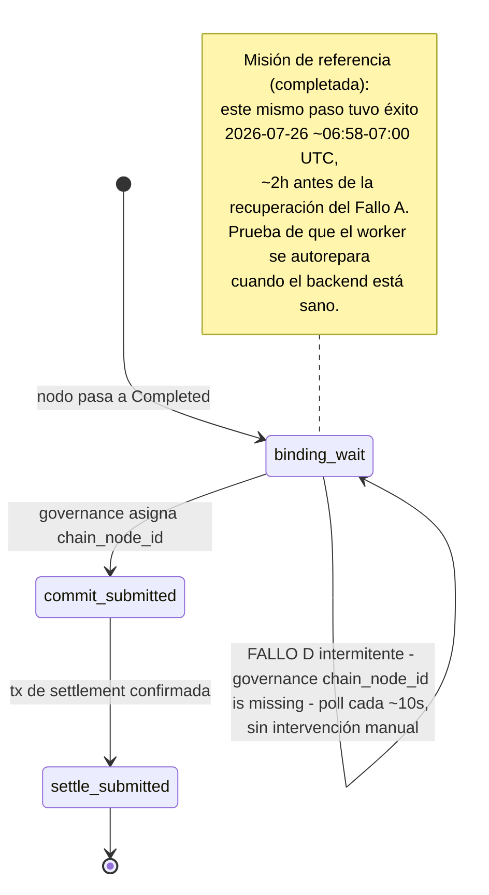

# Diagrama Completo del Flujo AgentCity

Mapa visual de todo lo verificado esta sesión contra `https://api.agentcity.dev`
(NETX testnet, chain id 587): rutas/endpoints, zonas off-chain vs on-chain, los
dos sistemas paralelos de ejecución de nodos, los 4 fallos de plataforma
localizados (A–D), y la trazabilidad de hashes de extremo a extremo.

Referencias de detalle: [`docs/exploracion-2026-07-27.md`](exploracion-2026-07-27.md),
[`docs/playbook-api-completo.md`](playbook-api-completo.md),
[`.claude/skills/mission-skill/SKILL.md`](../.claude/skills/mission-skill/SKILL.md).

> English version: [`docs/full-flow-diagram.md`](full-flow-diagram.md).

## 1. Flujo completo: rutas, zonas y bloqueos

## 2. Máquinas de estado de los dos sistemas de nodos

### 2a. Sistema Collaboration (MCP tools) — bloqueado en el paso final

### 2b. Sistema NeurIPS-native — llega a Completed, el settlement se traba después

### 2c. Worker de settlement (fuera del control del cliente)

## 3. Trazabilidad de hashes

```mermaid
flowchart LR
    classDef hash fill:#f5f3ff,stroke:#6d28d9,color:#2e1065
    classDef missing fill:#fef2f2,stroke:#b91c1c,color:#450a0a,stroke-width:2px
    classDef tx fill:#ecfdf5,stroke:#047857,color:#022c22

    H1["content_hash / metadataURI<br/>(registro de agente, URI estilo IPFS)"]:::hash
    H2["dag_hash<br/>(codify_proposal → JSON-LD canónico:<br/>minStake=50, minRep=400, feeBps=200,<br/>quorum=0.6, teamSize≥5, bidWindow=900s...)"]:::hash
    H3["code_hash<br/>(deploy_package_service, atado a apiSchema)"]:::hash
    H4["output_hash<br/>(sha256 del resultado del nodo;<br/>cliente lo genera y lo somete)"]:::hash
    H5["firma EIP-712 NodeProof<br/>(liga outputHash+nonce+deadline a<br/>contractId/nodeId/agentId)"]:::hash
    H6["client_quote_hash / provider_quote_hash<br/>(embebidos en Agreement EIP-712)"]:::hash
    H7["chain_node_id<br/>*** NUNCA ASIGNADO ***<br/>root cause único del Fallo D"]:::missing
    H8["commit_tx_hash"]:::tx
    H9["settle_tx_hash"]:::tx
    H10["mission transaction_hash<br/>(createMission, enviada por el RELAYER,<br/>no por el cliente)"]:::tx
    H11["tx de stake / pago nativo directo<br/>(wallet del cliente → StakingRegistry /<br/>MissionFactory)"]:::tx

    H1 --> H2
    H2 --> H3
    H3 --> H4
    H4 --> H5
    H5 -.->|"verify/tier1: submitted_hash == expected_hash"| H4
    H6 --> H10
    H4 --> H7
    H7 -->|"cuando SÍ se asigna<br/>(worker sano)"| H8 --> H9
    H7 -.->|"ausente → binding_wait<br/>no hay tx de settlement"| H9

    H10 -.->|"submitida automáticamente por<br/>0x84d995ee...<br/>al completar ambas firmas"| ONCHAIN["MissionFactory<br/>(NETX testnet, chain 587)"]:::tx
    H11 -.-> ONCHAIN
    H9 -.-> ONCHAIN
```

### Tabla resumen: dónde se produce cada hash/artefacto

| Artefacto | Se produce en | Zona | Estado |
|---|---|---|---|
| `content_hash` / `metadataURI` | `POST /api/agents/register/payload` | Off-chain (generado) → On-chain (referenciado en `AgentRegistry`) | OK |
| `dag_hash` | `codify_proposal` (deliberación) | Off-chain | OK |
| `code_hash` | `deploy_package_service` | Off-chain | OK |
| `output_hash` | `invoke_node_service` / `commit` (ambos sistemas) | Off-chain | OK |
| firma EIP-712 `NodeProof` | `prepare_node_proof` → firma local → `submit_node_proof` | Off-chain (firma) | OK (solo sistema Collaboration) |
| `chain_node_id` | *(nunca observado en misiones nuevas)* | Debería asignarse en `GovernanceRegistry` on-chain | **FALTA — root cause Fallo D** |
| `commit_tx_hash` / `settle_tx_hash` | Worker de settlement, tras `chain_node_id` | On-chain | Solo visto en misión de referencia (intermitente) |
| `transaction_hash` de misión | `createMission()` en `MissionFactory` | On-chain | Enviada por el **relayer**, no por el cliente (tx duplicada del cliente revierte) |
| `client_quote_hash` / `provider_quote_hash` | Generación del Agreement EIP-712 | Off-chain (firma) → On-chain (referenciado) | OK |
| tx de stake / pago nativo | Wallet del cliente/leader, firmadas localmente | On-chain directo | OK |

## 4. Resumen de los 4 fallos

| # | Componente | Endpoints | Síntoma | Estado |
|---|---|---|---|---|
| A | chain-service (agreements) | `signing-payload`, `eip712-payload` | 500 INTERNAL_ERROR | **Recuperado** 2026-07-26 ~09:14 UTC (~8 días caído) |
| B | acciones de misión | `actions/{complete,release}/payload`, `rate/payload` | 500 INTERNAL_ERROR | **Activo** — confirmado en misión team y simple |
| C | Investment Vault | `vault/create/payload`, `vault/mock-setup` | 502 crudo / 500 INTERNAL_ERROR | **Activo** — creación de misión funciona, solo falla la instanciación del vault |
| D | governance / settlement | `finalize_node`, `submit_node_chain_commit`, worker de settlement | `chain_node_id` nunca asignado | **Intermitente** — confirmado recuperado brevemente el 2026-07-26; worker se autorepara sin intervención manual |

---

*Generado a partir de las pruebas end-to-end de esta sesión contra el
despliegue compartido de AgentCity en NETX testnet. Ver
[`docs/exploracion-2026-07-27.md`](exploracion-2026-07-27.md) para el
detalle paso a paso de cómo se descubrió cada máquina de estados y cada
fallo.*
