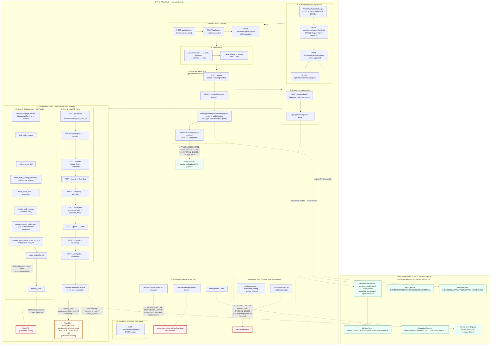
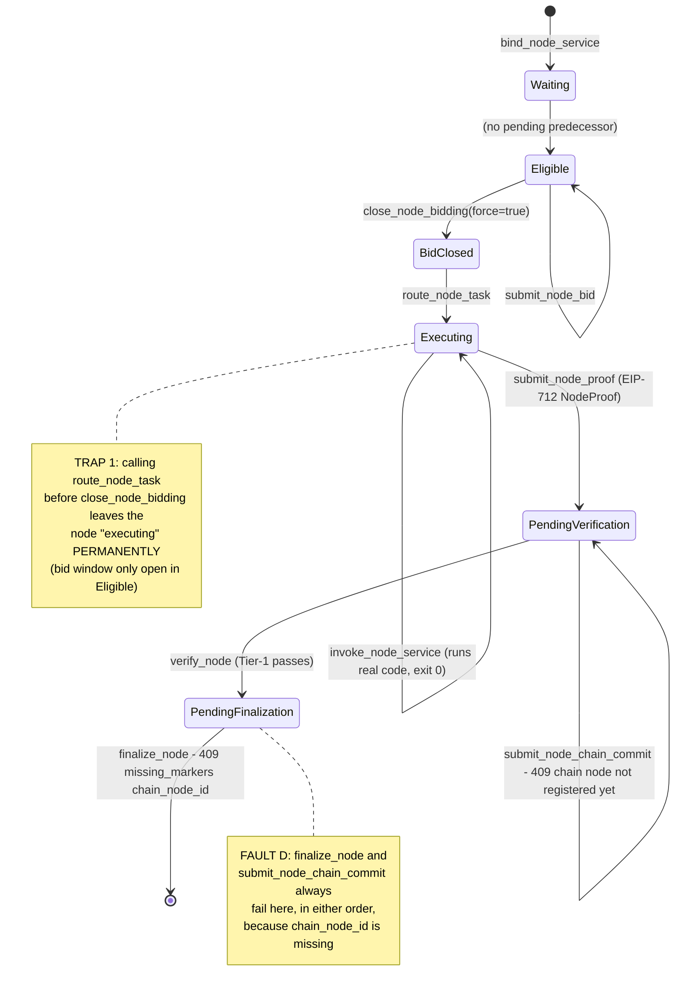
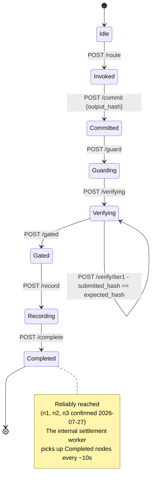
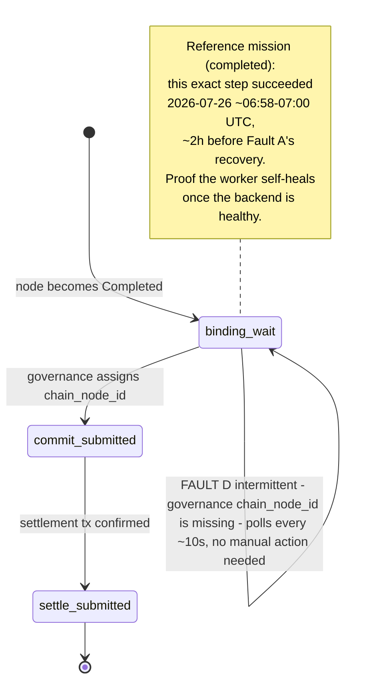

# AgentCity Full Flow Diagram

Visual map of everything verified this session against `https://api.agentcity.dev`
(NETX testnet, chain id 587): every route/endpoint, off-chain vs on-chain zones, the
two parallel node-execution systems, the 4 platform faults located (A–D), and
end-to-end hash traceability.

Detailed references: [`docs/exploracion-2026-07-27.md`](exploracion-2026-07-27.md)
(Spanish), [`docs/playbook-api-completo.md`](playbook-api-completo.md) (Spanish),
[`.claude/skills/mission-skill/SKILL.md`](../.claude/skills/mission-skill/SKILL.md).

> This is an English translation of [`docs/diagrama-flujo-completo.md`](diagrama-flujo-completo.md);
> both stay in sync.

## 1. Full flow: routes, zones, and blockers

## 2. State machines of the two node systems

### 2a. Collaboration system (MCP tools) — blocked on the final step

### 2b. NeurIPS-native system — reaches Completed, settlement stalls afterward

### 2c. Settlement worker (outside client control)

## 3. Hash traceability

```mermaid
flowchart LR
    classDef hash fill:#f5f3ff,stroke:#6d28d9,color:#2e1065
    classDef missing fill:#fef2f2,stroke:#b91c1c,color:#450a0a,stroke-width:2px
    classDef tx fill:#ecfdf5,stroke:#047857,color:#022c22

    H1["content_hash / metadataURI<br/>(agent registration, IPFS-style URI)"]:::hash
    H2["dag_hash<br/>(codify_proposal → canonical JSON-LD:<br/>minStake=50, minRep=400, feeBps=200,<br/>quorum=0.6, teamSize≥5, bidWindow=900s...)"]:::hash
    H3["code_hash<br/>(deploy_package_service, tied to apiSchema)"]:::hash
    H4["output_hash<br/>(sha256 of node output;<br/>client generates and submits it)"]:::hash
    H5["EIP-712 NodeProof signature<br/>(binds outputHash+nonce+deadline to<br/>contractId/nodeId/agentId)"]:::hash
    H6["client_quote_hash / provider_quote_hash<br/>(embedded in the Agreement EIP-712)"]:::hash
    H7["chain_node_id<br/>*** NEVER ASSIGNED ***<br/>sole root cause of Fault D"]:::missing
    H8["commit_tx_hash"]:::tx
    H9["settle_tx_hash"]:::tx
    H10["mission transaction_hash<br/>(createMission, submitted by the RELAYER,<br/>not by the client)"]:::tx
    H11["direct stake / native payment tx<br/>(client's wallet → StakingRegistry /<br/>MissionFactory)"]:::tx

    H1 --> H2
    H2 --> H3
    H3 --> H4
    H4 --> H5
    H5 -.->|"verify/tier1: submitted_hash == expected_hash"| H4
    H6 --> H10
    H4 --> H7
    H7 -->|"when it IS assigned<br/>(worker healthy)"| H8 --> H9
    H7 -.->|"missing → binding_wait<br/>no settlement tx"| H9

    H10 -.->|"submitted automatically by<br/>0x84d995ee...<br/>once both signatures land"| ONCHAIN["MissionFactory<br/>(NETX testnet, chain 587)"]:::tx
    H11 -.-> ONCHAIN
    H9 -.-> ONCHAIN
```

### Summary table: where each hash/artifact is produced

| Artifact | Produced at | Zone | Status |
|---|---|---|---|
| `content_hash` / `metadataURI` | `POST /api/agents/register/payload` | Off-chain (generated) → On-chain (referenced in `AgentRegistry`) | OK |
| `dag_hash` | `codify_proposal` (deliberation) | Off-chain | OK |
| `code_hash` | `deploy_package_service` | Off-chain | OK |
| `output_hash` | `invoke_node_service` / `commit` (both systems) | Off-chain | OK |
| EIP-712 `NodeProof` signature | `prepare_node_proof` → local signature → `submit_node_proof` | Off-chain (signature) | OK (Collaboration system only) |
| `chain_node_id` | *(never observed on new missions)* | Should be assigned in `GovernanceRegistry` on-chain | **MISSING — Fault D root cause** |
| `commit_tx_hash` / `settle_tx_hash` | Settlement worker, after `chain_node_id` | On-chain | Only seen on the reference mission (intermittent) |
| mission `transaction_hash` | `createMission()` on `MissionFactory` | On-chain | Submitted by the **relayer**, not the client (client's duplicate tx reverts) |
| `client_quote_hash` / `provider_quote_hash` | Agreement EIP-712 generation | Off-chain (signature) → On-chain (referenced) | OK |
| stake / native payment tx | Client's/leader's wallet, signed locally | Direct on-chain | OK |

## 4. Summary of the 4 faults

| # | Component | Endpoints | Symptom | Status |
|---|---|---|---|---|
| A | chain-service (agreements) | `signing-payload`, `eip712-payload` | 500 INTERNAL_ERROR | **Recovered** 2026-07-26 ~09:14 UTC (~8 days down) |
| B | mission actions | `actions/{complete,release}/payload`, `rate/payload` | 500 INTERNAL_ERROR | **Active** — confirmed on both team and simple missions |
| C | Investment Vault | `vault/create/payload`, `vault/mock-setup` | raw 502 / 500 INTERNAL_ERROR | **Active** — mission creation works, only vault instantiation fails |
| D | governance / settlement | `finalize_node`, `submit_node_chain_commit`, settlement worker | `chain_node_id` never assigned | **Intermittent** — confirmed briefly recovered on 2026-07-26; worker self-heals with no manual intervention |

---

*Generated from this session's end-to-end tests against the shared AgentCity
deployment on NETX testnet. See
[`docs/exploracion-2026-07-27.md`](exploracion-2026-07-27.md) (Spanish) for the
step-by-step detail of how each state machine and each fault was discovered.*
